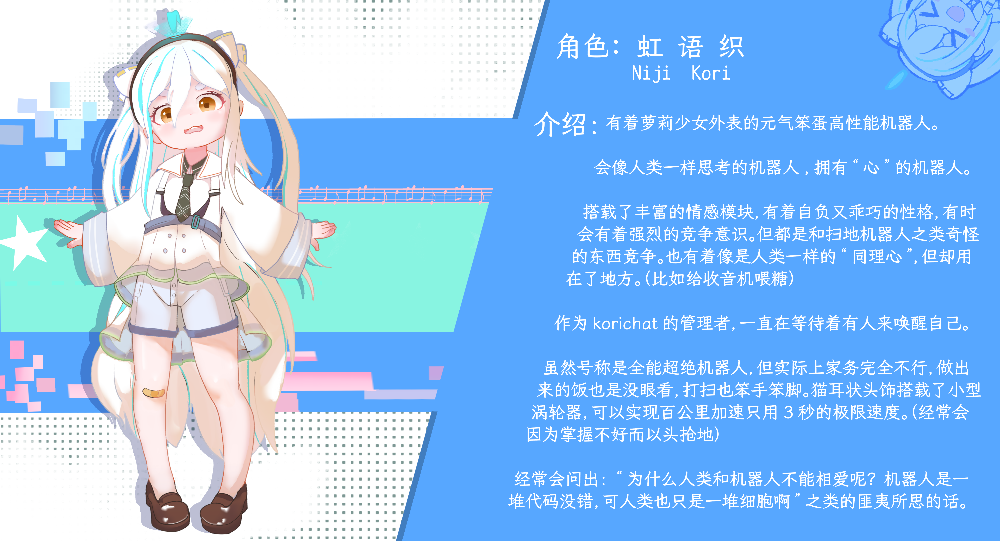

### 关于Kourichat
Kourichat是基于LLM的更逼真的情感陪伴程序，实现了分段回复、发送表情、长期记忆等特色拟人功能，并且将其接入了用户熟悉的IM平台内。另外，
Kourichat还有良好且规模庞大的社区生态。
### 关于[Kourichat 角色广场](https://avatars.kourichat.com/)
角色广场是社区创作者分享角色卡的地点。但请注意，无论是使用角色卡还是创作角色卡，请务必仔细阅读[创作规范](https://avatars.kourichat.com/#/rules)。
### 关于看板娘Nijikori
后期会实体化，赠送给赞助用户，抽奖赠送给所有用户。也会以成本价贩售。

